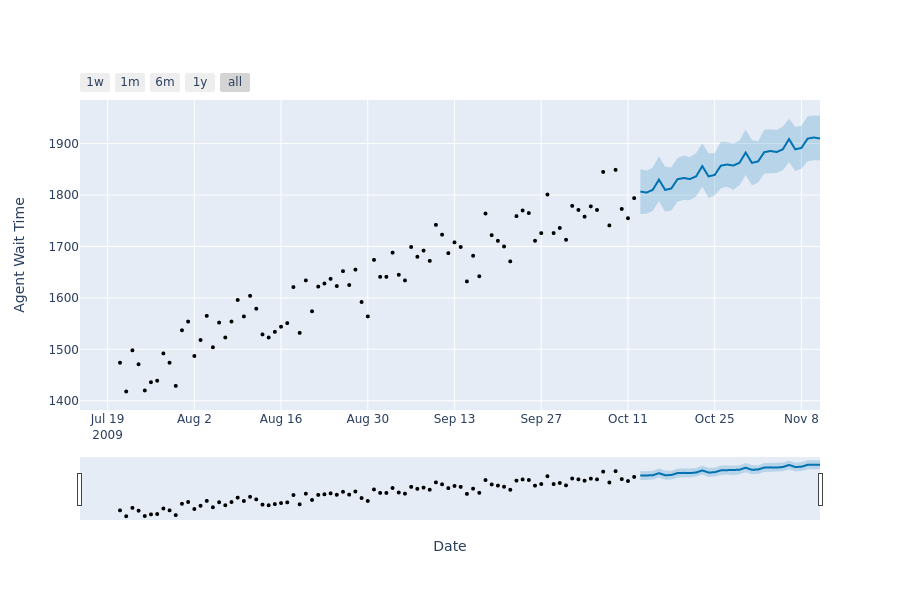

# Example 2: Run forecasts on metrics and send visualizations to Slack
In this example we use [prophet](https://facebook.github.io/prophet/) and [slack_sdk](https://slack.dev/python-slack-sdk/) in order to make predictions on our models and send the resulting plots to slack.

See [slack example](slack-example.md), for instructions on how to set up a minimal Slack bot.

This example is built for a model that has two columns: `y` and `ds`, where `y` is a metric measure and `ds` is a timestamp. The metric that we look at is Agent Wait Time in minutes.

## Meta tag
In a `schema.yml` file, within a target model, a meta tag should be added in order to connect the model to fal:
```yaml
    meta:
      fal:
        scripts:
			- path_to_fal_script.py
```

## Make a forecast
First, we write a function that will fit a given DataFrame and make a prediction based on that fit. Assuming we already have a DataFrame with histotic data, fitting this data using prophet is done like this:
```python
from fbprophet import Prophet

m = Prophet()
m.fit(input_dataframe)
```

We need decide how far into the future our prediction should run and then create another DataFrame that will hold that future data:

```python
n_future_days = 30
ds = dataframe["ds"].max()
future_dates = []
for _ in range(n_future_days):
    ds = ds + datetime.timedelta(days=1)
    future_dates.append(ds)

df_future = pd.DataFrame({"ds": future_dates})
```

We are ready to do a forecast:

```python
forecast = m.predict(df_future)
```

This `forecast` object can be used to make a plot and save it as a picture:
```python
from fbprophet.plot import plot_plotly

fig = plot_plotly(m, forecast, xlabel="Date", ylabel="Agent Wait Time")
fig.write_image("some_file_name.png")
```
This results in a plot like this:



Putting it all together into a function:
```python
def make_forecast(dataframe: pd.DataFrame, filename: str):
    """Make forecast on metric data."""
    m = Prophet()
    m.fit(dataframe)

    n_future_days = 30
    ds = dataframe["ds"].max()
    future_dates = []
    for _ in range(n_future_days):
        ds = ds + datetime.timedelta(days=1)
        future_dates.append(ds)
    df_future = pd.DataFrame({"ds": future_dates})
    forecast = m.predict(df_future)
    fig = plot_plotly(m, forecast, xlabel="Date", ylabel="Agent Wait Time")
    fig.write_image(filename)
    return filename
```

## Send forecast to Slack
Having setup Slack bot as outlined in our [slack example](slack_example.md), we can use `slack_sdk` to send a file to our slack channel:

```python
def send_slack_file(
    file_path: str, message_text: str, channel_id: str, slack_token: str
):
    """Send file to slack."""
    client = WebClient(token=slack_token)

    try:
        client.files_upload(
            channels=channel_id,
            file=file_path,
            title="FAL forecast",
            initial_comment=message_text,
        )
    except SlackApiError as e:
        assert e.response["error"]
```

## Running the script on a dbt model
We use the `ref` function to get a DataFrame of our associated dbt model (the model that has the fal meta tag):

```python
model_df = ref(context.current_model.name)
```

Then we run the forecast and send the result to slack:
```python
FORECAST_PREFIX = "fal_forecast_"
CHANNEL_ID = os.getenv("SLACK_BOT_CHANNEL")
SLACK_TOKEN = os.getenv("SLACK_BOT_TOKEN")

forecast = make_forecast(
    dataframe=model_df, filename=f"{FORECAST_PREFIX}{time.time()}.png"
)
send_slack_file(
    file_path=forecast,
    message_text=message,
    channel_id=CHANNEL_ID,
    slack_token=SLACK_TOKEN,
)
```
You can find the full code example [here](scripts/forecast_slack.py).
