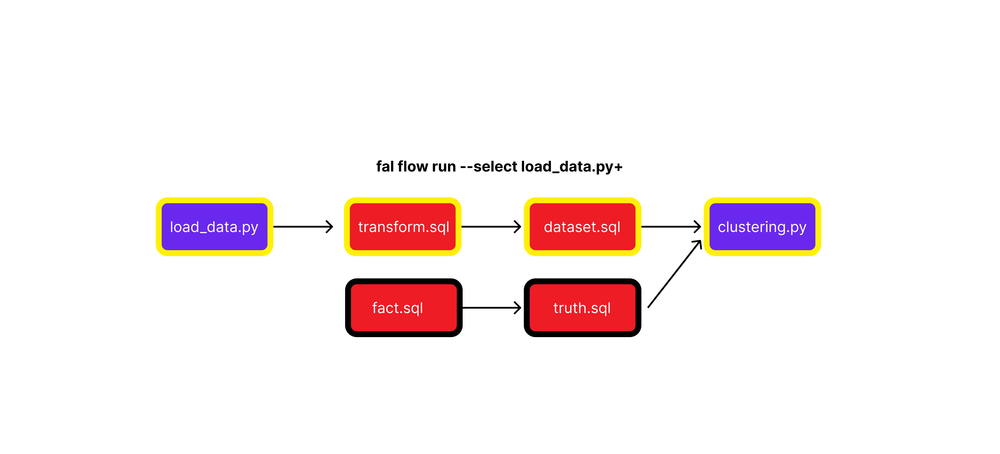

# Run Python in a dbt project

> ✨ NEW ✨ : If you want to create dbt models head over to the [dbt-fal](/dbt-fal/quickstart) adapter documentation 

fal extends dbt's functionality to run Python scripts before and after dbt models. With fal you can interact with dbt models in your Python scripts seamlessly.

This is done using the command `fal flow run`.

Under the hood, the workflow is run in 3 parts:

1. Runs the pre-hook Python scripts assgined as `before` scripts
2. Runs the dbt models
3. Runs the post-hook Python scripts assgined as `after` scripts


_Yellow border indicates which models are run with the command_

Consider the example DAG above. Triggering a `fal flow run` command will run all the nodes, sql and python with a single command.

```bash
$ fal flow run
## Runs the following nodes; load_data.py, transform, dataset, fact, truth, clustering.py
```

---

You can also use the familar [dbt graph operations](https://docs.getdbt.com/reference/node-selection/graph-operators). For example `fal flow run load_data.py+` would only run the node itself and downstream dependencies of the `load_data.py` node.


_Yellow border indicates which models are run with the command_

```bash
$ fal flow run --select load_data.py+
## Runs the following nodes; load_data.py, transform, dataset, clustering.py
```

Alternatively, pieces of graph can be invoked individually in parts with the [`fal run`](fal-run.md) command.

```bash
$ fal run --before
## Runs the following nodes; load_data.py
$ dbt run
## Runs the following nodes; transform, dataset, fact, truth
$ fal run
## Runs the following nodes; clustering.py
```
