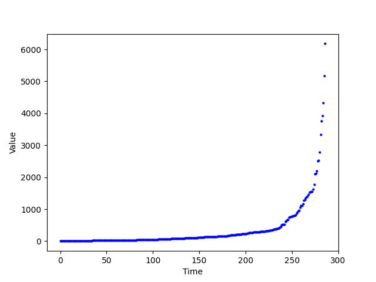
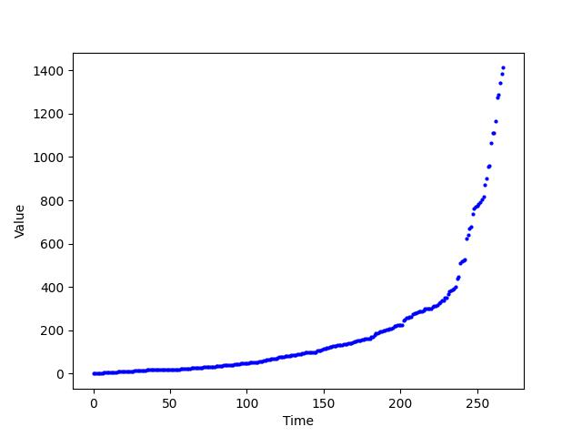
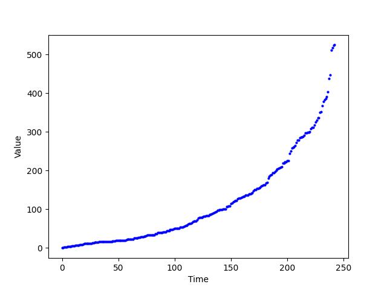
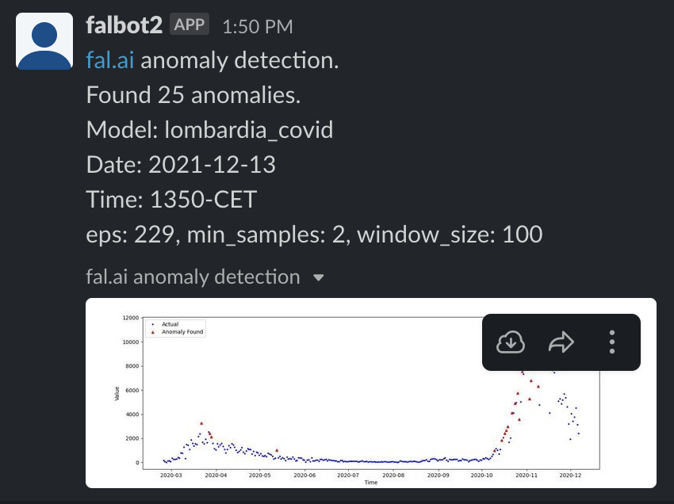
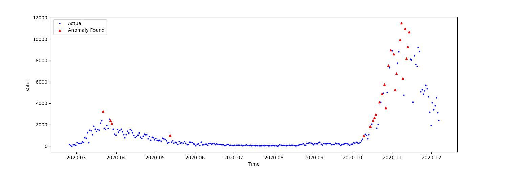

# Example 11: Run anomaly detection on metrics and send to Slack if there are any issues
In this example we will use [sklearn](https://scikit-learn.org/stable/index.html) and [slack_sdk](https://slack.dev/python-slack-sdk/) to find anomalies on a time-series numerical dataset.

See [slack example](slack-example.md), for instructions on how to set up a minimal Slack bot.

The model we use for this example has two columns: `y` and `ds`, where `y` is a metric measure and `ds` is a timestamp.

## Meta tag
In a `schema.yml` file, within a target model, a meta tag should be added in order to connect the model to fal:
```yaml
    meta:
      fal:
        scripts:
          - path_to_fal_script.py
```

## Finding anomalies on a model using DBSCAN
Our model for this example is from [a dataset of Covid-19 cases in Italy](https://www.kaggle.com/sudalairajkumar/covid19-in-italy?select=covid19_italy_region.csv). This kind of dataset is great for anomaly detection, as the Covid-19 cases shot up in forms resembling waves. Having a system that notices such abnormal trends in data is crucial for any use case, including our current fight against Covid-19.

TestsPerformed column in our dataset has 19% of its rows empty, so we get rid of it with a quick Python script using Pandas:
```python
import pandas as pd

df = pd.read_csv('covid19_italy_region.csv')
df.drop('TestsPerformed', axis=1, inplace=True)
df.to_csv('covid19_italy_region.csv')
```

Now, for us to find anomalies we need to write our Python script that will:
1. Take our model
2. Tune the hyperparameters for `DBSCAN` with a little help from our side
3. Feed it to `DBSCAN`
4. Plot the anomalies with the data on a Matplotlib figure and save it
5. Send the figure to a Slack channel using a bot with a message

The `DBSCAN` cluster that we are using for this example is a data clustering algorithm that groups together points that are close to each other. The groups are defined by the two hyperparameters `eps` for neighbourhood size and `min_samples` for minimum number of points reqiured in a cluster. After forming the groups, or the clusters, it labels the points that are in low density areas defined by the hyperparameters as noise, which are the anomalous data points for our case.

For the Python scripts, you can use these links; [main script](https://github.com/fal-ai/fal_dbt_examples/blob/main/fal_scripts/anomaly_detection.py)), [functions](https://github.com/fal-ai/fal_dbt_examples/blob/main/fal_scripts/anomaly_detection_functions.py).

We first create a function called `anomaly_detection`, which will take the column of metric values of our model, apply sliding windows, find anomalies and return them in a numpy array:

```python
def anomaly_detection(X: np.array, eps: float, min_samples: int, window_size: int):
    # Here we take the given column of values, apply sliding windows, save the number of how many windows we have,
    # and initialize the anomalies list, where we will record the indices of our anomalies.
    X_windowed = np.lib.stride_tricks.sliding_window_view(x=X, window_shape=window_size, axis=0)
    (size_0, _, _) = X_windowed.shape
    anomalies = []

    # For each window, we use DBSCAN and take note of the locations of the anomalous data points, or noises to use
    # the right term, which are noted with the value -1 in the labels array.
    for window in range(size_0):
        clustering = DBSCAN(eps=eps, min_samples=min_samples).fit(X_windowed[window][0][:].reshape(-1,1))
        labels = clustering.labels_
        location = np.where(labels == -1)
        location = location[0]
        size = location.size
        # If there are anomalies in our current window, we append their indices with respect to the input dataset,
        # not the current window.
        if size != 0:
            if size == 1:
                anomalies.append(location[0] + window)
            else:
                for i in range(size):
                    anomalies.append(location[i] + window)
        else:
            continue
    
    # We find the unique values in the anomalies list and convert them to a numpy array, as the window slides by
    # 1 index, the indices of the anomalies have been repeated in the list many times.
    anomalies = np.unique(np.array(anomalies))
    
    # And finally, we return the numpy array of indices of the anomalous data points.
    return anomalies
```

Now, as you might have noticed, the `DBSCAN` function takes two arguments, `eps` and `min_samples` which are passed from the `anomaly_detection` function. These are hyperparameters of `DBSCAN`; `eps` stands for epsilon and `min_samples` stands for minimum number of points that must be in the neighbourhood of a given point in epsilon distance. This example focuses on the implementation of the function, thus the concepts will not be explored further. For a more detailed definition check out [this Wikipedia article](https://en.wikipedia.org/wiki/DBSCAN).

You can hand tune these hyperparameters, but we can somewhat automate this time consuming process and make life easier. [This Medium article](https://medium.com/@mohantysandip/a-step-by-step-approach-to-solve-dbscan-algorithms-by-tuning-its-hyper-parameters-93e693a91289) explains the tuning process, check it out to get a better grasp on the subject.

First hyperparameter to tune is `min_samples`. To accomplish our goal, we write the function `find_ideal_min_samples`:

```python
def find_ideal_min_samples(X: np.array, range_min_samples: list):
    # We apply sliding windows to our column of values, as we will be using DBSCAN in each window. We also save
    # the number of windows and initialize min_sample_scores, a numpy array in which we will add the silhouette
    # score for each window for each min_sample values in separate columns.
    X_windowed = np.lib.stride_tricks.sliding_window_view(x=X, window_shape=window_size, axis=0)
    (size_0, _, _) = X_windowed.shape

    min_sample_scores = np.zeros(shape=(1, len(range_min_samples)))

    # Below, we compute and add our silhouette scores to the min_sample_scores array.
    for window in range(size_0):
        for i in range(len(range_min_samples)):
            clustering = KMeans(n_clusters=range_min_samples[i])
            cluster_labels = clustering.fit_predict(X_windowed[window][0][:].reshape(-1,1))
            silhouette_avg = silhouette_score(X_windowed[window][0][:].reshape(-1,1), cluster_labels)
            min_sample_scores[0][i] = min_sample_scores[0][i]+silhouette_avg
    
    # Here, we divide the total scores for all min_samples values to find and average for each. From those, we
    # select the min_samples value with the highest score, which is our ideal min sample, and we return it.
    min_sample_scores = min_sample_scores / size_0
    ideal_min_sample = range_min_samples[np.where(min_sample_scores.max)[0][0]]

    return ideal_min_sample
```

Next is `eps`. To find the ideal `eps` value, we have two stages; first we find a range of `eps` values, then we compute silhouette scores for each and use the highest scoring one.

```python
def find_eps_range(X: np.array, range_const: int):
    # The first thing we need to do is to calculate the distances between each consecutive sample, store them
    # in a numpy array and sort them. 
    dists = np.zeros_like(X)
    for i in range(X.size-1):
        dist = np.linalg.norm(X[i]-X[i+1])
        dists[i] = dist
    dists = np.sort(dists, axis=0)

    # Below, we have two Matplotlib figures; one is the entire set of distances and the other one is the same
    # as the other, but its distance value axis is bounded. The PATH_PREFIX is a global constant that you need
    # to set beforehand, which is the path of the fal_dbt_exams repo on your local machine.
    plt.plot([i for i in range(dists.size)], dists, 'b.', markersize=4)
    plt.xlabel('Time')
    plt.ylabel('Value')
    plt.savefig(f'{PATH_PREFIX}/fal_scripts/anomaly_detection_other/distance_between_samples.jpg')
    plt.clf()

    bounded_dists_i = np.where(dists<=range_const*5)[0]
    plt.plot(bounded_dists_i, [dists[i] for i in bounded_dists_i], 'b.', markersize=4)
    plt.xlabel('Time')
    plt.ylabel('Value')
    plt.savefig(f'{PATH_PREFIX}/fal_scripts/anomaly_detection_other/distance_between_samples_bounded.jpg')
    plt.clf()
```

This is where our system needs some supervision. However, please note that this can also be automated for a fully unsupervised anomaly detection system, but requires more dedication. For our example, the extra work can't be justified, also it provides a visual insight to how the `eps` is selected.

To find the ideal `eps`, we first need to plot the distance between each consecutive data point. For our case, the distance between the points is the difference of number of daily positive Covid-19 cases between each time index. In this plot, we are looking for a curve with an elbow, or a knee, as the exact elbow point is the ideal `eps`.


Also, we need the smallest value possible, which means that we need the curve in the smallest range posssible. To bound the range, we create a constant, namely the `range_conts`, for convenience, as the constant is a fraction of the maximum of the range of our data. We use this constant to bound our range now and also create our `eps` range in increments of it. We have to try values for `range_const` and find an elbow curve in our plot with the smallest constant value. Here we have the first figure, which has not been bounded yet:



As we can see, there is a curve with a really sharp bend. However, as we said before, for an optimal `eps` range we need to bound the plot.

Here we have a bounded curve with a `range_const` roughly equaling 2.5% of the maximum value of the distances. Setting the `range_const` to this value often provides a good starting point. In our case, it is the plot we are looking for:



If we set the `range_const` even smaller, to roughly 1% of the maximum, we get a parabola like curve, not the sharp elbow we are looking for.



Now all we have to do is to create a relatively small range of `eps` values to test:

```python
range_const = int(floor(np.amax(column_y)*0.025))
range_eps = range(range_const, (range_const*5)+1, range_const)
```

Altough you are free to change `stop` and `step` of the `range` function, if we take a look at the bounded plot with the good range constant, it is visible that a higher `stop` won't be necessary. For the `step`, it is really up to your compute power, for our example, going up with a `step` size of `range_const` is OK.

Now that we have a range of `eps` values to test, it is time to see how they fare against each other. We set up a function called `find_ideal_eps` to do the job:

```python
def find_ideal_eps(X: np.array, min_samples: int, window_size: int, range_eps: list):
    # Again, we apply sliding windows to our column of values, take note of the number of windows, and
    # initialize an array that is esentiallt same as min_sample_scores, but for epsilon values.
    X_windowed = np.lib.stride_tricks.sliding_window_view(x=X, window_shape=window_size, axis=0)
    (size_0, _, _) = X_windowed.shape

    eps_scores = np.zeros(shape=(1, len(range_eps)))

    # Here, we compute silhouette scores of each eps value and get a sum for all the windows. For the
    # clustering we use DBSCAN, which means that we will be using our recently found ideal min_samples value,
    # as the two hyperparameters affect each other.
    for window in range(size_0):
        for i in range(len(range_eps)):
            clustering = DBSCAN(eps=range_eps[i], min_samples=min_samples).fit(X_windowed[window][0][:].reshape(-1,1))
            labels = clustering.labels_
            if np.unique(labels).size > 1:
                silhouette_avg = silhouette_score(X_windowed[window][0][:].reshape(-1,1), labels)
                eps_scores[0][i] = eps_scores[0][i]+silhouette_avg
    
    # We calculate the average and return the ideal eps value.
    eps_scores = eps_scores / size_0

    ideal_eps = range_eps[np.where(eps_scores.max)[0][0]]

    return ideal_eps
```

In this section, we first created the `anomaly_detection` function which takes the model, `min_samples` and `eps` hyperparameters, then returns the indices of the anomalous points. Then we created the `find_ideal_min_samples` function which finds the ideal `min_samples` value for `anomaly_detection`. After that, we created the two functions `find_eps_range` and `find_ideal_eps`, which are used to first find the range which has the ideal `eps` value, then find it based on the `min_samples` value we have found before. This is what is needed to find anomalies on a given model. However, we want our script to also plot the anomalies and send them to us via Slack. So, we need to set up two more functions to get a Slack bot to message us some information and a plot of the anomalies in our model.

## Sending results via Slack
The two functions we need are `plot_anomalies` and `send_slack_file`. The `send_slack_file` function is present in both the [metric forecast](metric-forecast.md) and [slack bot](slack-example.md) examples.

```python
def plot_anomalies(column_y: np.array, column_date: np.array, anomalies: np.array):
    # Below, we plot the data and note tha anomalies in a Matplotlib figure. Then, we save the figure with
    # a name that is the timestamp of the time which the anomalies was computed. Then, we return the path
    # of the figure for the Slack function.
    fig = plt.figure(figsize=(15,5))
    axes = fig.add_axes([0.1, 0.1, 0.8, 0.8])
    axes.plot([column_date[i] for i in range(column_y.size)], column_y, 'b.', markersize=4)
    axes.plot([column_date[i] for i in anomalies], [column_y[i] for i in anomalies], 'r^', markersize=4)
    axes.set_xlabel('Time')
    axes.set_ylabel('Value')
    axes.legend(['Actual', 'Anomaly Found'])
    now = str(datetime.datetime.now())
    now = now[:10]+'-'+now[11:13]+now[14:16]
    fpath = f'{PATH_PREFIX}/fal_scripts/anomaly_detection/{now}-{TIMEZONE}.jpg'
    fig.savefig(fname=fpath)
    plt.clf()

    return fpath
```

```python
def send_slack_file(file_path: str, message_text: str, channel_id: str, slack_token: str):
    # Here, we take the filename of the saved figure and send it with a message.
    client = WebClient(token=slack_token)

    try:
        client.files_upload(
            channels=channel_id,
            file=file_path,
            title="fal.ai anomaly detection",
            initial_comment=message_text,
        )
    except SlackApiError as e:
        assert e.response["error"]
```

## Finding anomalies on a dbt model with fal
At last, we have all the functions needed for anomaly detection. However, there is a very important thing missing: Our model. Using fal we can load our model in the form of a DataFrame with ease using the extremely handy `ref()` function and the `context` object.

```python
model_df = ref(context.current_model.name).sort_values(by='ds')
```

Now that we have all our functions and our model, we can write the following that ties everything together for our script:

```python
# Then, we separate the DataFrame by columns into the values, 'y', and dates, 'ds'. Then we reshape them
# to fit our functions.
column_y = model_df['y'].to_numpy(dtype=np.float).reshape(-1,1)
column_date = model_df['ds'].to_numpy(dtype=datetime.datetime).reshape(-1,1)

# Here, we set the arbitrarily chosen window size for the sliding windows application. For the size of
# our model, 100 is a good window size.
window_size = 100

# Here, we set and arbitrary list of min_samples values, for numerical time-series data, the list below is good.
# With the range of possible min_samples values, we use our find_ideal_min_samples to find the min_samples for
# our system.
range_min_samples = [2,3,4,5]
min_samples = find_ideal_min_samples(column_y, range_min_samples)

# With our min_samples value, we find the optimal epsilon value.
range_const = int(floor(np.amax(column_y)*0.025))
find_eps_range(column_y, range_const)
range_eps = range(range_const, (range_const*5)+1, range_const)

eps = find_ideal_eps(column_y, min_samples, window_size, range_eps)

# Finally, we find the anomalies using our anomaly_detection function, and send them via Slack, while also sending
# a handy command line message.
anomalies = anomaly_detection(column_y, eps, min_samples, window_size)
fpath = plot_anomalies(column_y, column_date, anomalies)
now = str(datetime.datetime.now())
date = now[:10]
hour = now[11:13]+now[14:16]

print(f'anomalies: {anomalies.size}\ndata: {column_y.size}\npercentage: {(anomalies.size/column_y.size)*100}%')

# This is to get around a bug, usually it is not needed.
ssl._create_default_https_context = ssl._create_unverified_context

message = f'fal.ai anomaly detection.\nFound {anomalies.size} anomalies.\nModel: {context.current_model.name}\nDate: {date}\nTime: {hour}-{TIMEZONE}\neps: {eps}, min_samples: {min_samples}, window_size: {window_size}'
# The CHANNEL_ID and SLACK_TOKEN are global variables that have been set beforehand to the Slack bot and channel
# that we are using.
send_slack_file(fpath, message, CHANNEL_ID, SLACK_TOKEN)
```



And, that's it. We have our Slack bot notifying us about the anomalous data points. Now, let's take a look at the anomalies that have been spotted on our data and do a little analysis:



As we can see, the system finds 3 anomalies in the first wave and 1 while the wave flattens. This behaviour is unexpected, however it is insignificant enough that only the extreme outliers are reported as anomalous. In this second wave, we can observe a much, much more sharp upwards trend that the system classifies most of the wave as anomalous.

In this example, we can see the power of fal, as we can have an extremely vital and time sensitive system directly from your dbt project. 

## Moving further
The next step for this example would be to get the system production ready by implementing it into your existing dbt based pipeline. But, for the example to be a pipeline ready system, the main bottleneck is finding the range for the ideal `eps`. A system can be implemented to detect the elbow curve using [mathematical analysis](https://en.wikipedia.org/wiki/Mathematical_analysis) to solve this issue. Other than that, the system is a modular block so, the connections of your pipeline can be configured for your specific needs. I.e. our example with the Covid-19 data can be used to trigger a PSA or manage social distancing rules.