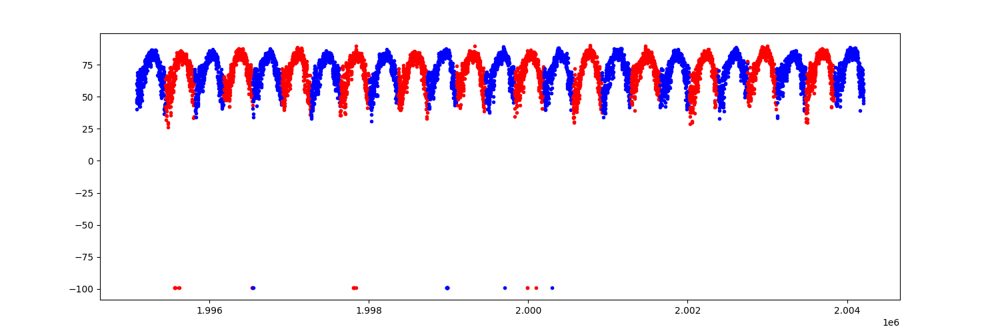
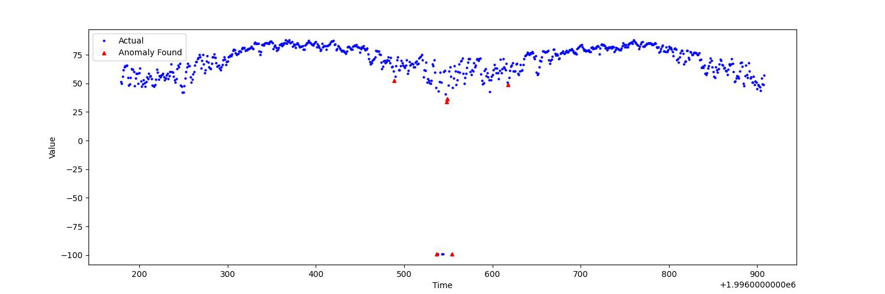
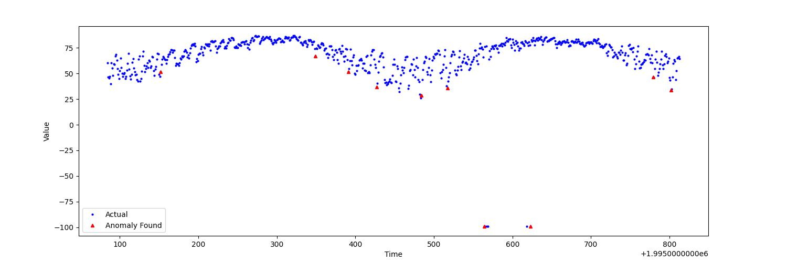

# Example 12: Detecting data drift on dbt models
In this example we will use [scipy](https://scipy.org) to find if there is a data drift on a time-series numerical dataset.

The model we use for this example has two columns: `y` and `x`, where `y` is the metric measure and `x` is the index.

## The dbt model

[The dataset](https://www.kaggle.com/sudalairajkumar/daily-temperature-of-major-cities) we are using for this example is the daily average temperatures of major cities around the world. In this dataset, the existance of a data drift indicates that there is a change in temperatures for a given time period, preferably a year. Thus, we can observe the effects of climate change in the context of temperature change.

For our model, we will be using the data for the city of New Orleans, arguably the most vulnerable city against climate change in the US. The specific surface temperature data for New Orleans directly affects the people and the ecosystem in the city, but also is indicative of the existence of global temperature change, as anywhere else in the world. The choice of city is arbitrary and trivial to the subject of climate change but, New Orleans is used here to emphasize its effects. As the global change in temperature is proportional to the rise in sea levels, the data drift script can be used to keep track of any changes in the continous data of surface temperatures, thus being used as a efficient measurement tool of climate change.
 
In the dataset we have some columns that we don't need, which are `State`, `Country`, `Region`, `Month`, `Day`, `Year`. We don't need the location based columns besides `City`, as we will create our model on the data for the city of New Orleans. We also don't need the date based columns, as we will only use data for one city for which we can use indexes as our date guide. Thus we delete them.

```python
import pandas as pd

# Your path to the dbt project.
PATH_PREFIX = ''

df = pd.read_csv(f'{PATH_PREFIX}/data/city_temperature.csv')

df.pop('State')
df.pop('Country')
df.pop('Region')
df.pop('Month')
df.pop('Day')
df.pop('Year')

df.to_csv(f'{PATH_PREFIX}/data/city_temperature.csv')
```

Now that we have our modified CSV file, we `dbt seed` the dataset upstream. As we have our data upstream now, we can write the following dbt model in our project:

```sql
{{ config(materialized='table') }}

WITH source_data as (
    select * from {{ ref('city_temperature') }}
)

SELECT
    AvgTemperature as y,
    a as x
FROM
    source_data
WHERE
    City = 'New Orleans'
```

In our model, we only select the data for the city of New Orleans, and set `AvgTemperature` as `y`, as it is our metric value. We also set the `a` values in our data to `x` for indexing.

## The script

Now that we have our model to work on, we can write our script so that fal can show us it's magic. For detecting data drift, we use a test called the [Kolmogorov-Smirnov test](https://en.wikipedia.org/wiki/Kolmogorov–Smirnov_test), specifically the 2 sample test. What the test does is that it essentially finds the underlying distributions of each of the data and checks if they are the same with a confidence level. The confidence level is generally set to 95% for optimal results. For our script, we will use the `ks_2samp` function provided by the `scipy` library, which is the test we talked about. It takes two sets of data as its arguments, then returns the test statistic and the probability level, the `p_value`. We take and compare the `p_value` against `1 - confidance_level = 0.05`. If the p_value is less than it, data drift is present.

```python
# Your path to the dbt project.
PATH_PREFIX = ''

import sys
sys.path.append(f'{PATH_PREFIX}/fal_scripts')

import numpy as np
from scipy.stats import ks_2samp
import matplotlib.pyplot as plt
from math import floor


def data_drift(data_1, data_2):
    test = ks_2samp(data_1, data_2)

    # Our target for the p_value, it is equal to 1 - confidence level.
    p_value = 0.05

    result = 0
    if test[1] < p_value:
        result = 1
    else:
        result = 0

    return result
```

We take the `ks_2samp` test we talked about before and put it in a function where it compares the `p_value` to our confidence level based target, then returns a boolean representing the existence of data drift.

```python
# Here we get our model and sort it by index x.
model = ref(context.current_model.name).sort_values(by='x')

# In the model we have 9265 days, so we delete the last 140 days to make it perfectly divisible into years.
model['y'] = model['y'].astype(float)
y = model['y'].to_numpy()[:-140]

model['x'] = model['x'].astype(float)
x = model['x'].to_numpy()[:-140]

# Here we slice it into years and create lists of numpy arrays containing the temperatures for each year.
n = floor(int(y.shape[0])/365)
y_windowed = np.split(y, n, axis=0)
x_windowed = np.split(x, n, axis=0)

# We plot the data for a visual of the split, we color the even years with blue and odd years with red.
fig = plt.figure(figsize=(15,5))
axes = fig.add_axes([0.1, 0.1, 0.8, 0.8])

for i in range(len(y_windowed)):
    if (i % 2) == 0:
        color = 'b.'
    else:
        color = 'r.'
    axes.plot(x_windowed[i], y_windowed[i], color)

plt.savefig(f'{PATH_PREFIX}/fal_scripts/data.png')
```

Here we have the plot of the split data:



```python
# We create a list which will contain the tuples of consecutive years in which data drift occurs.
dd_years = []

# For each year and its succesor we apply the data_drift function. Then, we append the tuple of the years into the dd_years list.
for i in range(len(y_windowed)-1):
    if data_drift(y_windowed[i], y_windowed[i+1]):
        dd_years.append((i,i+1))
    else:
        continue

# Then we print the list of years which data drift occurs.
print(f'Data drift found in {dd_years}.')

```

Now that we have our script ready, we can edit the schema of our dbt project for fal to run our script.

## Editing `schema.yml` to run the script

```yaml
version: 2

models:
  - name: city_temperatures
    description: New Orleans Temperatures
    config:
      materialized: table
    meta:
      fal:
        owner: "@you"
        scripts:
          - fal_scripts/data_drift.py
```

For finding data drift in our dbt models, this is all we need. Get your model and set the time window length, and you are ready to go.

However, some might question the existence of a separate system for detecting data drift, as we had an anomaly detection system with DBSCAN in a [previous example](https://blog.fal.ai/building-a-data-anomaly-detection-system-with-fal-dbt/). In the next section, we will see why using a separate system for data drift is justified.

## Data drift vs Anomaly detection

The first point to look at is what problems do these systems solve? Simply put, anomaly detection detects anomalous data points, whereas data drift detects anomalous time windows. Thus, anomaly detection gives us the data points that are out of place and data drift notifies us that there is a change in the overall data distribution. For these specific insights, we employ different methods to find the solution; for anomaly detection we use DBSCAN, and for data drift we use the Kolmogorov-Smirnov test. DBSCAN is a clustering algorithm; simply put, it find an anomalous point by clustering it with neighbouring data points with two hyperparameters, epsilon and number of minimum samples (n). These two hyperparameters define the cluster, which is made up core points where each point has at least n number of points inside a circle with radius epsilon centered on the point, i.e A; and edge points which do not satisfy the conditions of being a core point but is part of a core point's circle, i.e B and C. The points which are not core or edge points are called noised points (N), the anomalous data points.

.](DBSCAN-illustration.png)

This clustering ability makes DBSCAN the go to anomaly detection algorithm. It can group the closely packed normal data, which represents the normal behaviour of the data, and detect the anomalies which are far away from the normal. However, it is not that good at detecting data drift. As in the case of data drift, the anomaly is not a single point but rather a group of points. Using a clustering algorithm like DBSCAN where the closely packed data is grouped and accepted as normal, continous movement of a group from those neighbouring it cannot be detected. Below, we have a part of our data from our example, years 4 and 5, where there is a continous drift from one to the other, anomaly detection fails to identify the change in behaviour of the dataset, but it notifies us of the extreme data points.



Data drift also cannot do the work of the other system. Kolmogorov-Smirnov test is a statistical test where two samples of empirical data is checked to see if they are from the same distribution. This gives us the ability to see if a change in the distribution of numerical data exists, which for time-series numerical data is the definition of data drift. For big time windows, such as a year, anomalous data points does not affect the test, as their effect is negligible to the result because the test uses a confidence level, set to 95% for this example. The only way that anomalous data points can influence the result is that they have to be a sizeable chunk of the data window. Below, again from the example model, we have the years 1 and 2, where there is no data drift but anomalous data points are present. We can see that data drift cannot even give us an insight to whether anomalous data points exist, let alone their location.



## Moving further

From the comparison, we can clearly see that anomaly detection and data drift systems cannot do each other's work. However, when combined, they create a powerful data analysis tool which can be implemented into a pipeline to provide machine learning models and data analysts with more insight towards the behaviour of the data. From there, notification, data cleaning and many more systems can be added downstream for various use cases.

From a technical perspective for data drift, no further improvements are needed besides optimizing the Komogorov-Smirnov test if possible.

You can find the entire script via this [link](https://github.com/fal-ai/fal_dbt_examples/blob/main/fal_scripts/data_drift.py).