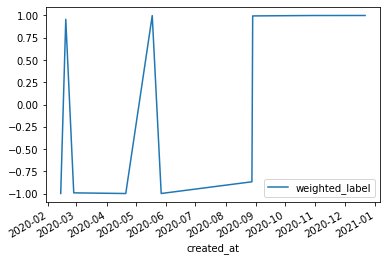

# Example 9: Use dbt from a Jupyter Notebook

We also offer fal as an importable package to load in a Python environment to reference and use your dbt models and sources.
You may want to do this to run some ad-hoc analysis on the data.

We start by importing fal into your project

```py
from fal import FalDbt
```

Then instantiate a new FalDbt project with the dbt project information:

```py
faldbt = FalDbt(profiles_dir="~/.dbt", project_dir="../my_project")

faldbt.list_sources()
# [['results', 'ticket_data_sentiment_analysis']]

faldbt.list_models()
# {
#   'zendesk_ticket_metrics': <RunStatus.Success: 'success'>, 
#   'stg_o3values': <RunStatus.Success: 'success'>, 
#   'stg_zendesk_ticket_data': <RunStatus.Success: 'success'>, 
#   'stg_counties': <RunStatus.Success: 'success'>
# }
```

Reference these objects as you would in a regular fal script, from the `faldbt` object:

```py
sentiments = faldbt.source('results', 'ticket_data_sentiment_analysis')
# pandas.DataFrame
tickets = faldbt.ref('stg_zendesk_ticket_data')
# pandas.DataFrame
```

NOTE: You can use any other function available in the fal script runtime through the `faldbt` object.

Then you can just use the data in these Pandas DataFrames to analyze and plot an interesting graph:

```py
def calc_weighted_label(row):
  val = 1 if row['label'] == 'POSITIVE' else -1
  return val * row['score']

joined = sentiments.merge(tickets, on='id')
joined['weighted_label'] = joined.apply(calc_weighted_label, axis=1).astype(float)

from matplotlib import pyplot as plt

joined.plot(y=['weighted_label'], x='created_at')
plt.show()
```



## Full example
You can find the full code example [here](https://github.com/fal-ai/fal_dbt_examples/blob/main/analyze_sentiment.ipynb).
