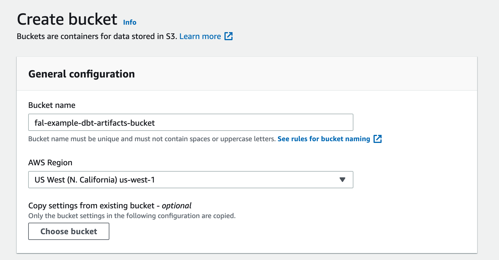

# Example 8: Write dbt artifacts to AWS S3

Dbt artifacts are files created by the dbt compiler after a run is completed. They contain information about the project, help with documentation, calculate test coverage and much more. In this example we are going to focus on two of these artifacts `manifest.json` and `run_results.json`.

[`manifest.json`](https://docs.getdbt.com/reference/artifacts/manifest-json) Is a full point-in-time represantation of your dbt project. This file can be used to pass [state](https://docs.getdbt.com/docs/guides/understanding-state) to a dbt run using the `--state` flag.

[`run_results.json`](https://docs.getdbt.com/reference/artifacts/run-results-json) file contains timing and status information about a completed dbt run.

There might be several reasons why might want to store `dbt` artifacts. The most obvious reason would be to use the `--state` functionality to pass the previous state back to dbt. Besides that these artifacts can be stored in a database to later be analyzed..

## Create an S3 Bucket

Navigate the [S3 console](https://s3.console.aws.amazon.com/s3/home) and create a bucket. In the screenshot below I named the my bucket `fal-example-dbt-artifacts-bucket`, pick a unique name for yourself and complete the next steps as you see fit.



## Fal Script

Now navigate to your dbt to project, create a directory for your fal scripts and create a python file inside that directory. [For example](https://github.com/fal-ai/fal_dbt_examples/tree/main/fal_scripts/upload_to_s3.py) a directory named `fal_scripts` and a python file named `upload_to_s3.py`.

In your python file you'll write the script that would upload `dbt` artifacts to S3.

```python
import os
import boto3

s3_client = boto3.client('s3')

bucket_name = "fal-example-dbt-artifacts-bucket"
manifest_source_file_name = os.path.join(context.config.target_path, "manifest.json")
run_results_source_file_name = os.path.join(context.config.target_path, "run_results.json")
manifest_destination_blob_name = "manifest.json"
run_results_destination_blob_name = "run_results.json"


s3_client.upload_file(manifest_source_file_name, bucket_name, manifest_destination_blob_name)
s3_client.upload_file(run_results_source_file_name, bucket_name, run_results_destination_blob_name)
```

This script will use [default credentials](https://docs.aws.amazon.com/cli/latest/userguide/cli-configure-envvars.html) set in your environment for AWS, one way to do this is to set `AWS_ACCESS_KEY_ID` and `AWS_SECRET_ACCESS_KEY` as environment variables.

## Meta tag

Next, we need to configure when this script will run. This part will be different for every usecase. Currently there are two types of triggers, a script can be configured per model or globally for the whole project. In this example we want this script to run once, not for any specific model.

To configure this navigate to your `schema.yml` file or create one if you dont have one and add the following yaml entry.

```yaml
fal:
  scripts:
    - fal_scripts/upload_to_s3.py
```

## Full example
You can find the full code example [here](https://github.com/fal-ai/fal_dbt_examples/blob/main/fal_scripts).
